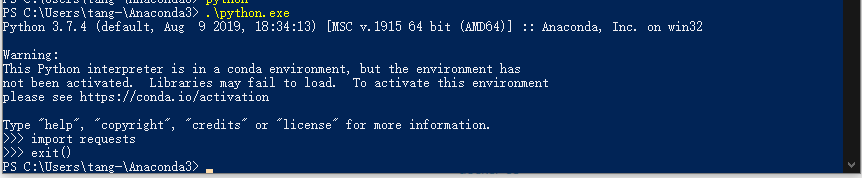
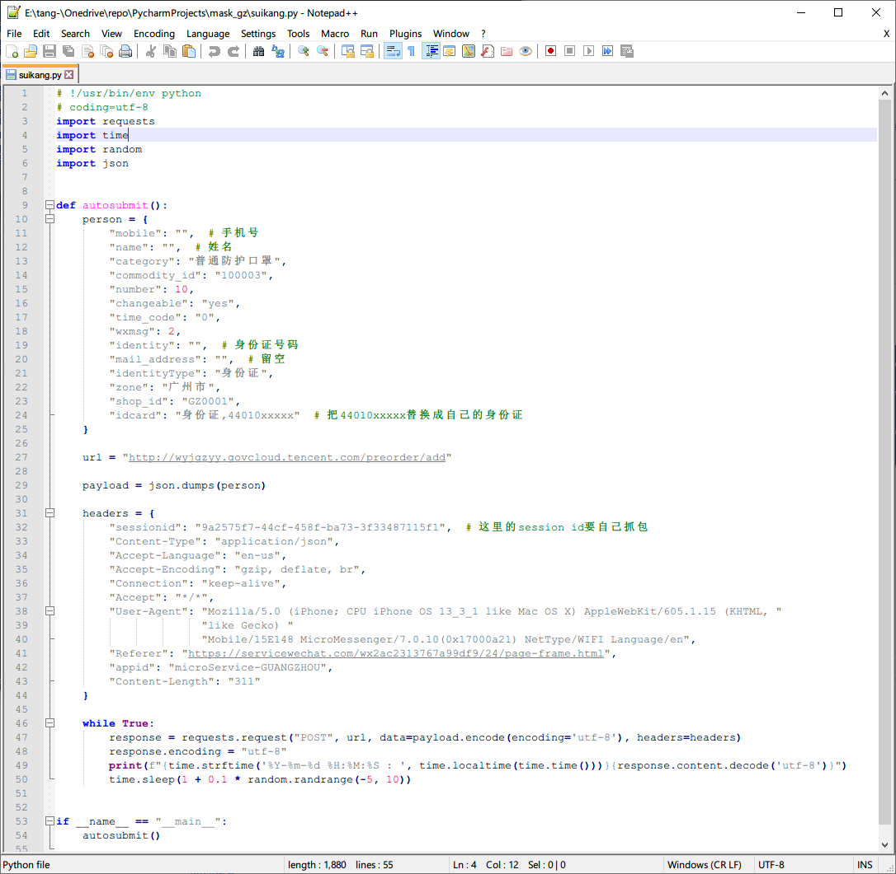
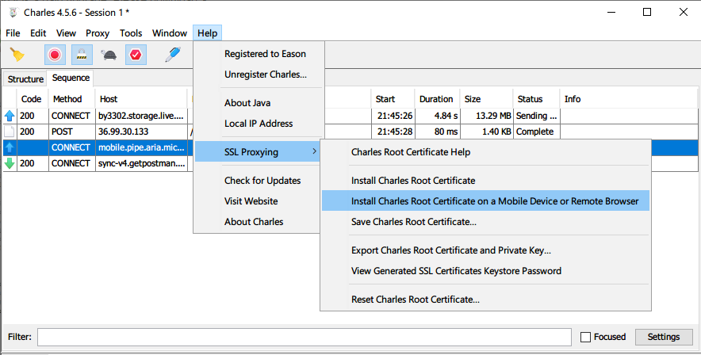
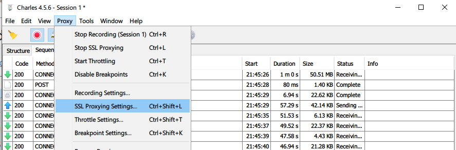
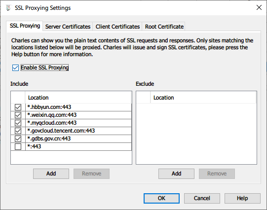
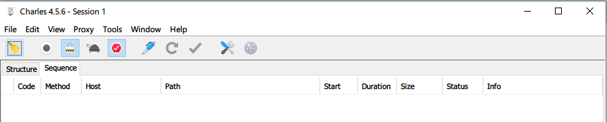
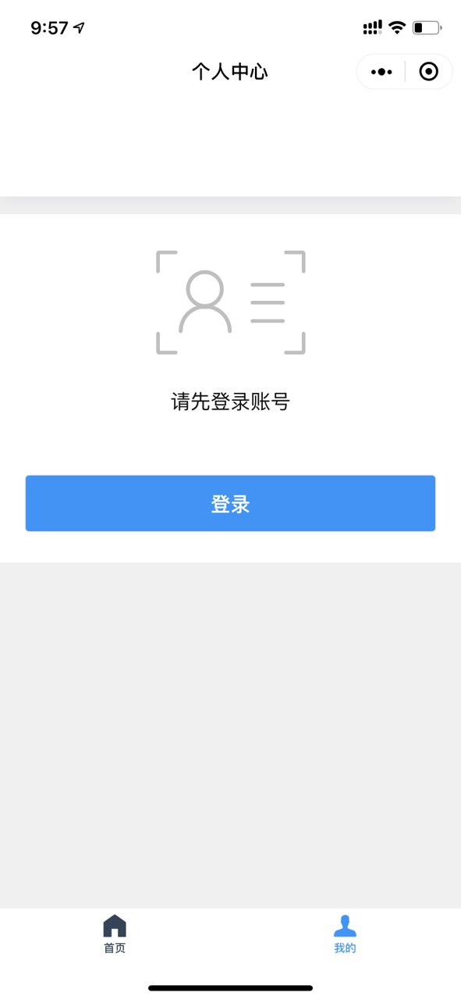
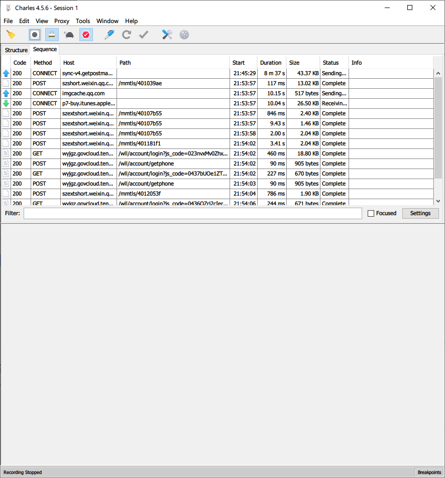
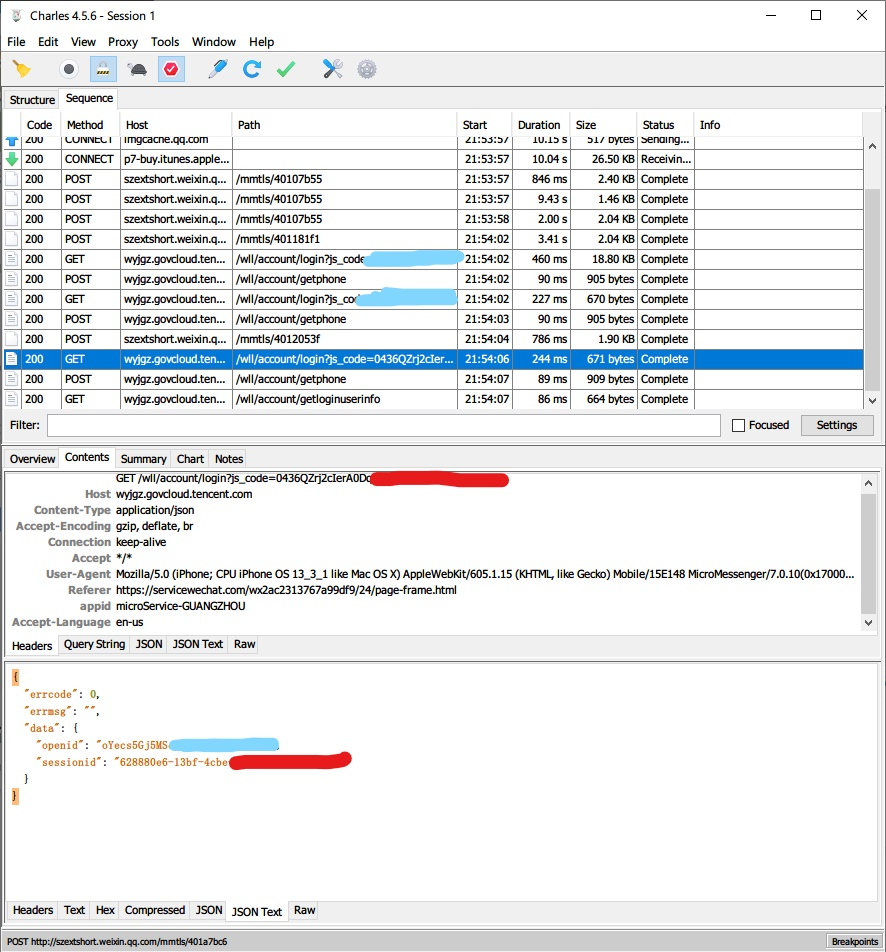

# mask_gz

免责声明：本教程仅用于研究学习之用，请勿用于其他用途

## 1. 安装python环境

下载地址：https://mirrors.tuna.tsinghua.edu.cn/anaconda/archive/Anaconda3-2019.10-Windows-x86_64.exe

一路回车，回车装完之后在我的文档里面应该能看到Anaconda3的文件夹，把他的路径记录下来，本例中是：C:\Users\tang-\Anaconda3

打开命令行或者powershell，依次执行下面的命令

```
cd C:\Users\tang-\Anaconda3
.\python.exe -m pip install -i https://pypi.tuna.tsinghua.edu.cn/simple requests
```

检测环境是否装好：



如果没有报错，则说明ok

## 2. 编辑一点脚本的参数

用**除了系统自带记事本之外**的软件打开py脚本，根据#壕开头的注释编辑参数



## 3.获取sessionid

安装Charles：https://www.charlesproxy.com/download/#



点击Install Charles Root Certificate on ......，根据提示设置好代理服务器并且安装好证书



进入Proxy-SSL Proxy Settings



如上图所示添加以下域名

```
*.hbbyun.com
*.weixin.qq.com
*.myqcloud.com
*.govcloud.tencent.com
*.gdbs.gov.cn
```



工具栏上左边扫把图标是清空数据，扫把右边一个的圆形图标是开始抓包



打开穗康小程序，先退出登录



退出登录之后点击圆圈开始抓包，然后登陆，登陆成功后点击圆圈停止抓包



从上往下翻，找到如下的数据包，讲sessionid后的62开头字符串复制进脚本（引号不用复制），另外要注意看看是不是最新的数据包，有时候登陆失败sessionid会刷新

抓包完成

## 4. 运行

在杠杠的命令行内运行

```powershell
.\python.exe E:\tang-\Onedrive\repo\PycharmProjects\mask_gz\suikang.py
```

其中“E:\tang-\Onedrive\repo\PycharmProjects\mask_gz\suikang.py”是脚本的路径